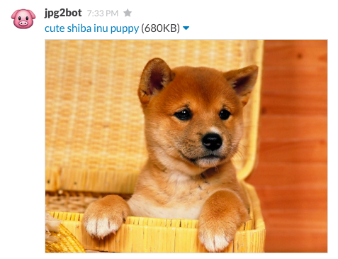

# jpg2bot

`jpg2bot` is a re-implementation of [jpgtobot](https://github.com/hlian/jpgtobot) that uses the superior [tightrope](https://github.com/ianthehenry/tightrope) library in preference to the dangerous [linklater](https://github.com/hlian/linklater).

The functionality is the same but for one crucial difference: `jpg2bot` has a random animal as the emoji, whereas `jpgtobot` is always just a 🎁.

Weighing in at a *healthy* 39 [lines of code](https://github.com/ianthehenry/jpg2bot/blob/master/Main.hs), `jpg2bot` is the smart choice for photographic experts on the lookout for shiba inus.

# Features

- randomized response emoji
- echoes input
- doesn't believe that flagrant international vigilantism can be called justice

# How do I use it

It's really easy! You just need to fill out a `conf` file.

    $ cp conf.example conf
    $ vim conf # do things here
    $ cabal sandbox init
    $ cabal install -j --only-dependencies
    $ cabal run
